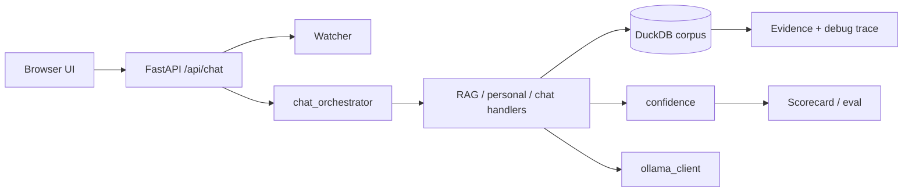

# Tyrone 3.0

Tyrone 3.0 is a local-first FastAPI + Ollama assistant with three modes:

- `chat` for plain assistant replies, optionally grounded on one document
- `document` for hybrid RAG over a DuckDB corpus with evidence and confidence scoring
- `personal` for memory retrieval plus tool routing for GoBook and workspace tasks

`chat` and `document` are the customer-facing modes and ship enabled. `personal`
wires to the operator's own GoBook/Google/WhatsApp accounts and is **off by default**;
enable it with `TYRONE_ENABLE_PERSONAL=1` (see environment overrides below).

It also has a deterministic demo/eval path via `OLLAMA_FAKE=1`, which keeps screenshots,
scorecards, and CI-friendly runs stable even when Ollama is unavailable.

## What It Looks Like



## Current Scorecard

Measured in this workspace on 2026-06-01.

| Metric | Result | Target |
|---|---:|---:|
| Tests | 148 passed | 100% |
| Coverage (`app/`, `rag/`) | 93% | >= 90% |
| Ruff | pass | 0 errors |
| Mypy (`app rag`) | pass | 0 errors |
| Dead code | pass | 0 high-confidence findings |
| Retrieval recall@k | 100% | >= 90% |
| Faithfulness | 100% | >= 90% |
| Refusal accuracy | 100% | >= 90% |
| Confidence calibration | 100% | >= 90% |
| Intent routing | 100% | >= 90% |
| Robustness | 0 unhandled 500s | 100% |
| Perf: retrieval warm p95 | 44.7 ms | < 500 ms |
| Perf: chat warm p95 | 31.3 ms | < 1000 ms |
| Docs | Present | Present |

## Setup

Requirements:

- Python 3.10+
- Ollama for live runs, or `OLLAMA_FAKE=1` for deterministic demo/eval mode

Install:

```bash
python -m venv venv
venv\Scripts\activate
pip install -r requirements.txt
```

If you want live Ollama chat, make sure a model is available:

```bash
ollama run qwen2.5-coder:7b
```

If you use GoBook or personal tool routing, create `secrets.json` with:

```json
{
  "username": "your-gobook-username",
  "password": "your-gobook-password"
}
```

`secrets.example.json` shows the same schema with placeholder values.

Optional environment overrides:

- `TYRONE_ENABLE_PERSONAL=1` exposes `personal` mode and its tool endpoints (off by default)
- `OLLAMA_FAKE=1` uses deterministic fake model responses for demo/eval runs
- `GOBOOK_SECRETS_FILE` points to a GoBook credentials JSON if you do not want to use `secrets.json`
- `GOOGLE_WORKSPACE_DIR` points the Google OAuth helpers at a different workspace folder
- `WHATSAPP_PROFILE_DIR` overrides the persistent WhatsApp profile path

## Run The App

```bash
python main.py
```

Open:

```text
http://127.0.0.1:8000
```

For a reproducible demo without live Ollama, run in PowerShell:

```bash
$env:OLLAMA_FAKE="1"
python main.py
```

## One-Command Demo

Seed the app from the synthetic eval corpus:

```bash
python demo/seed.py
```

That script rebuilds the eval corpus, ingests it into the isolated eval database, and copies the
result into `rag_v2.db` so the UI starts with a ready-made demo corpus.

The scripted walkthrough is in [`demo/walkthrough.md`](demo/walkthrough.md).

## Run The Eval

The scorecard is the release gate:

```bash
python -m eval.scorecard
```

Useful direct evals:

```bash
python -m eval.retrieval_eval
python -m eval.faithfulness_eval
python -m eval.refusal_eval
python -m eval.confidence_eval
python -m eval.intent_eval
python -m eval.perf_eval
```

## Architecture Notes

See [`ARCHITECTURE.md`](ARCHITECTURE.md) for the request lifecycle, RAG pipeline, confidence
model, watcher, eval methodology, and the config tuning decisions from Sprints 3-4.

## Screenshots

Portfolio screenshots live in [`docs/img/`](docs/img/).

## Repository Notes

- The repo is self-contained from its own root; old `Demo5` and `Demo14_RPA` folder names are no
  longer required.
- `watcher.py` currently acts as a passive auditor: it evaluates rules and records notes, but does
  not block requests.

## License

Released under the [MIT License](LICENSE).
