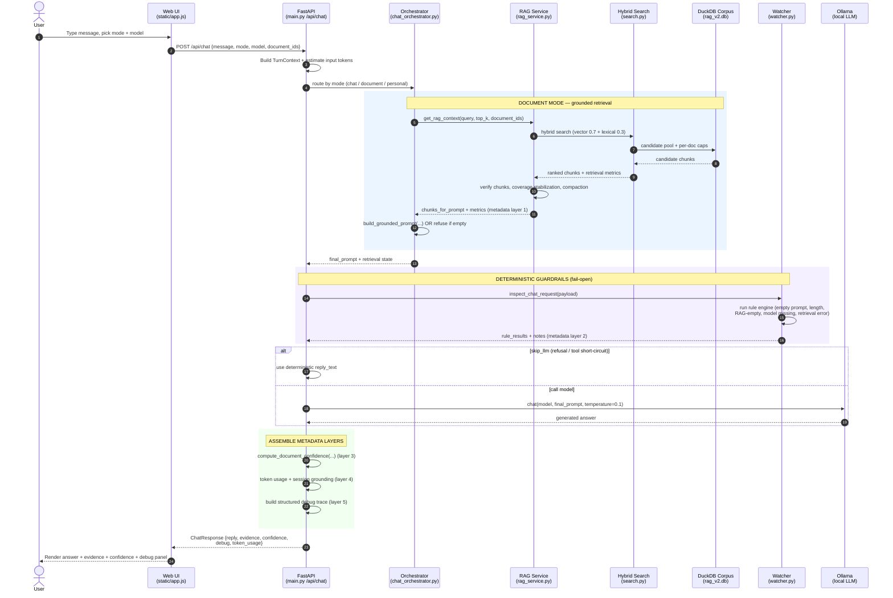
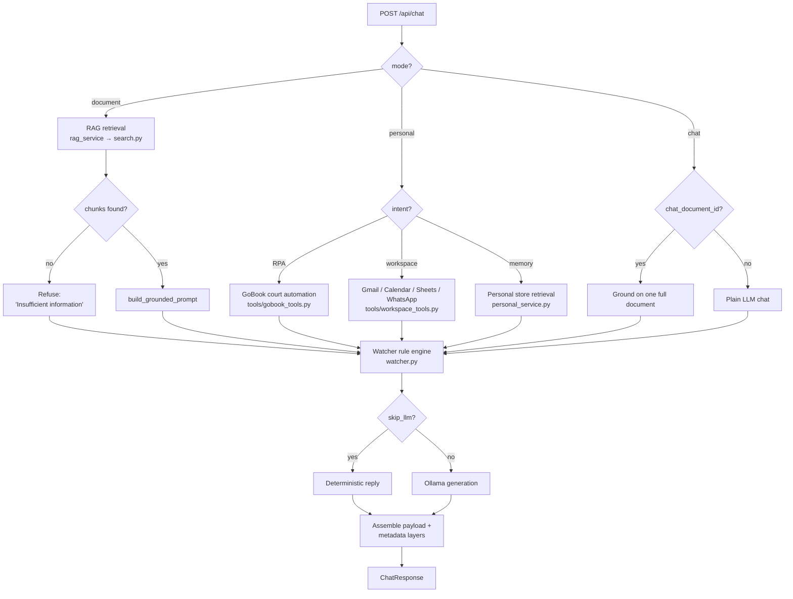

# Tyrone 3.0 — Request Lifecycle (Architecture Block Diagram)

This is the end-to-end lifecycle of a single chat request as it enters `main.py`, is routed
through `chat_orchestrator.py`, queries `search.py`, passes the deterministic `watcher.py`
guardrails, and returns a payload with **attached deterministic metadata layers** (retrieval
metrics, confidence, watcher rule results, token usage).

> The diagrams below are [Mermaid](https://mermaid.js.org/). They render natively on GitHub,
> in VS Code (Markdown Preview Mermaid Support), and in most portfolio site generators.

---

## 1. Sequence diagram — the full request lifecycle

---

## 2. Mode routing (what the orchestrator decides)

---

## 3. The deterministic metadata layers (the portfolio differentiator)

Every response carries machine-readable provenance, not just prose. This is what makes the engine
auditable — a key selling point for high-compliance use.

| Layer | Produced by | What it proves |
|---|---|---|
| **1. Retrieval metrics** | `rag_service.get_rag_context` | which chunks, scores, coverage mode, verification status |
| **2. Watcher rule results** | `watcher.inspect_chat_request` | deterministic guardrail checks (pass/fail, severity) |
| **3. Confidence** | `confidence.compute_document_confidence` | calibrated score + reason codes for the answer |
| **4. Token / session usage** | `token_utils` + `session_grounding` | per-turn and per-session cost accounting |
| **5. Debug trace** | `main.py` assembly | full request lineage for audit / replay |
